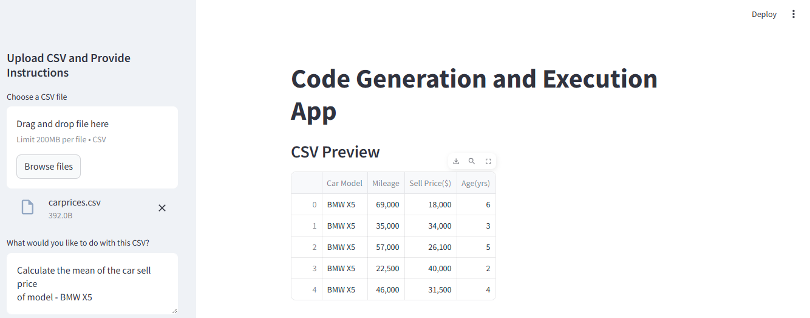
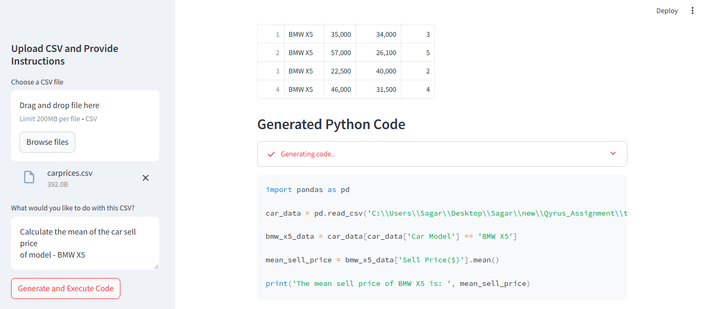
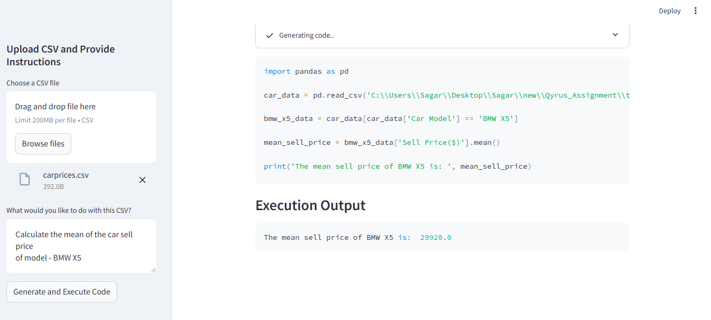

# Qyrus_Assignment

# Code Generation and Execution App

This application allows users to upload a CSV file and provide a task description in text. Based on the user input, Python code is generated, executed, and the results are displayed.

---

# Steps to run the Code:

1. Install all dependencies listed in requirements.txt:
---- pip install -r requirements.txt

2. Visit the Groq website and sign up for a free API key. Note that the key is valid for 24 hours after creation.

3. Once you have the API key, save it in a .env file at the root of your project.
  
  GROQ_API_KEY=your_api_key_here

4. Run the Application

   streamlit run test.py

## 1. User Input: CSV File and Text
The website allows users to upload a CSV file and enter a description of the task they want to perform on the CSV data. 

This step is where the user interacts with the app by uploading a file and providing a textual description of the task.

---

## 2. **Python Code Generation Based on User Text**
Based on the user's description, the app uses Groq to generate Python code that fulfills the task outlined in the user’s input. 

This step leverages AI to generate executable Python code that can process the uploaded CSV data according to the user’s instructions.

---

## 3. **Execution of the Generated Python Code**
Once the code is generated, it is executed within the application. The results of the execution are captured and displayed to the user.

This step runs the generated Python code and shows the user the output of their task.

---

## Conclusion
This app automates the process of generating and executing Python code based on user inputs. It enables users to upload CSV files, provide text-based instructions, and get results.

